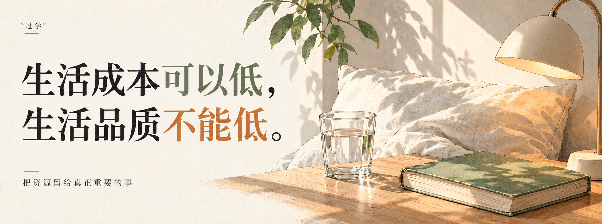

  

<h1 align="center">“过的人”行动指南</h1>

  “过学”｜过日子的学问 
  “过的人”｜坚定执行“过学”的人

 

  <strong>生活成本可以低， 生活品质不能低。</strong>

<em>“混的人”混日子，我们“过的人”过日子。</em>

---

## 前言

每天都在花钱，也在花时间、精力和注意力。付出的越来越多，日子却不一定过得更好。

**我们研究的不仅仅是怎么把日子过便宜，更是怎么用更低的综合成本，提升我们的生活品质。**

大水、长睡眠、薄肌、二手消费、租万物，各自在解决具体生活问题。“过学”从这些方法中寻找共同的判断：什么真正改善了生活，什么只是增加了负担。

把无效的消耗减下来，把资源留给健康、舒适、安全，以及自己在乎的人和事。该省的省，真正影响生活品质的地方别亏待自己。

## 目录

| 篇章 | 内容 |
| --- | --- |
| [第一章｜认识“过学”](docs/01-认识过学.md) | “过学”与“过的人”的含义、成本与品质、第一性原理、唯一的基本原则。 |
| [第二章｜具体生活方法](docs/02-具体生活方法/README.md) | 大水、长睡眠、薄肌、二手消费、租万物；租房归在租万物中。 |
| [第三章｜日常行动](docs/03-日常行动/README.md) | 从饮食、睡眠到工作、关系，把具体方法放进日常生活。 |
| [附录一｜过日子词典](docs/附录/过日子词典.md) | 常用概念的简短解释。 |
| [附录二｜收录与更新](docs/附录/收录与更新.md) | 理论的当前状态、适用范围和待补内容。 |
| [附录三｜一起补充这本指南](CONTRIBUTING.md) | 分享方法、补充来源、指出问题。 |

---

[开始阅读 →](docs/01-认识过学.md)
